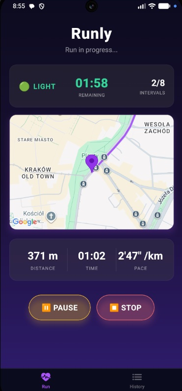
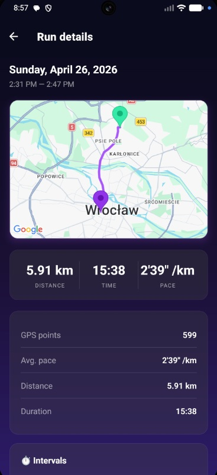

# Runly 🏃

> A mobile run tracking app built with React Native & Expo. Track your runs in real-time, analyse your performance and train smarter with built-in interval support.

<p style="text-align: center;">
  
  &nbsp;&nbsp;
  
</p>

---

## Features

- **Real-time GPS tracking** — records your route using the Haversine formula for accurate distance calculation
- **Live map** — draws your path as a `Polyline` on an interactive map, with camera following your position
- **Stats bar** — shows distance, elapsed time and current pace updated in real time
- **Interval training** — configure heavy/light intervals with countdown, voice feedback (`expo-speech`) and haptic-style transitions
- **Offline-first storage** — all runs are persisted locally with SQLite (no account needed)
- **Run history** — browse past workouts with a `FlatList`, tap to see full details and route replay
- **Dark glassmorphism UI** — deep purple gradient background, frosted-glass cards (`expo-blur`), neon glow buttons and safe-area aware layout
- **i18n** — full English / Polish support via `i18next`

---

## Tech stack

| Layer | Technology |
|---|---|
| Framework | React Native 0.81 + Expo SDK 54 |
| Navigation | Expo Router v6 (file-based, stack + tabs) |
| Maps | react-native-maps |
| Location | expo-location |
| Storage | expo-sqlite |
| UI effects | expo-blur, expo-linear-gradient |
| Voice | expo-speech |
| i18n | i18next + react-i18next |
| Language | TypeScript 5.9 (strict) |
| Linting | ESLint + Prettier |
| Testing | Jest + jest-expo + Testing Library |

---

## Project structure

```
src/
├── features/
│   ├── run/              # Run tracking — state machine, GPS hook, interval logic, screens
│   │   ├── consts/
│   │   ├── hooks/        # useRunTracking, useIntervalTimer
│   │   ├── screens/      # RunScreen, IntervalConfigScreen
│   │   ├── stores/       # runReducer (useReducer)
│   │   ├── types/        # RunState, RunAction, IntervalConfig, IntervalType
│   │   └── utils/
│   └── history/          # Past workouts — list, details, delete
│       ├── components/   # RunCard
│       ├── hooks/        # useRunHistory, useRunDetails
│       └── screens/
├── components/           # Shared feature components (MapView, StatsBar, IntervalBanner)
├── services/             # locationService, storageService (SQLite)
├── ui/                   # Design system — theme, GlassCard
├── consts/               # App-wide constants (units, map, config)
├── types/                # Global domain types (Run, Coordinate, IntervalSummary)
└── i18n/                 # Translations (en, pl)

app/                      # Expo Router routes
├── (tabs)/               # Bottom tab navigator
│   ├── index.tsx         # → RunScreen
│   └── history.tsx       # → HistoryScreen
├── run/[id].tsx          # → RunDetailsScreen
└── interval-config.tsx   # → IntervalConfigScreen
```

---

## Getting started

```bash
# Install dependencies
npm install

# Start Expo dev server
npm start

# Run on Android emulator / device
npm run android
```

> Requires [Node.js](https://nodejs.org) ≥ 18 and the [Expo Go](https://expo.dev/go) app or an Android emulator.

---

## Running tests

```bash
npm test
# or in watch mode
npm run test:watch
```
